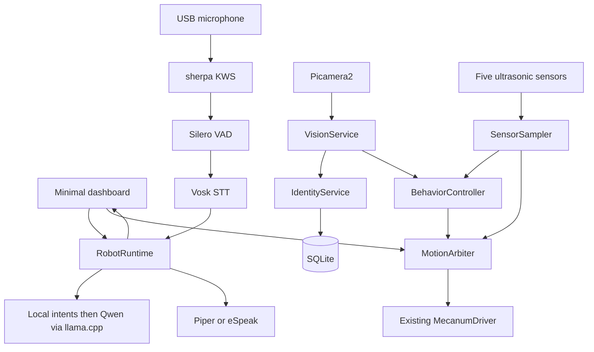

# AURUS Evaluation Edition Architecture

**Status:** implementation baseline  
**Target hardware:** Raspberry Pi 4B (8 GB), Camera Module V2, USB microphone, speakers, five HC-SR04 sensors, four mecanum wheels, two L298N drivers  
**Primary constraint:** the verified motor/sensor wiring, pins, and kinematics are preserved

## 1. Product definition

AURUS is a persistent recognizing companion rover. It detects and enrolls a person, remembers their name and facts, recognizes them later, follows them with camera and ultrasonic safety, speaks locally, and exposes its real decisions through a live dashboard.

The system is offline-first. Internet access is not required for dialogue, motion, safety, identity, memory, speech recognition, TTS, or the evaluation showcase.

### Showcase sequence

1. A person enters the camera view.
2. AURUS enrolls or recognizes them and greets them by name.
3. The person teaches AURUS a fact; SQLite stores it.
4. AURUS recalls the fact without cloud access.
5. Follow mode aligns to the face and maintains distance using the front sensor.
6. A physical obstacle causes a visible safety override.
7. Push-to-talk or the wake word accepts a local command or a question for the local LLM.
8. A deterministic mecanum showcase ends with all motors stopped.

## 2. Technology decisions

| Layer | Selected technology | Reliability rationale |
|---|---|---|
| OS/runtime | Existing Raspberry Pi OS + Python virtual environment | Avoids a risky OS reimage; Picamera2 remains installed through `apt`/system packages. |
| GPIO | Existing `rpi-lgpio`-compatible motor and sensor modules | Wiring and behavior are already verified and are not rewritten. |
| Camera | Picamera2 | Raspberry Pi's supported Python camera API for Camera Module V2. |
| Vision | OpenCV YuNet + SFace | Small detection model, persistent embeddings, explicit unknown/uncertain states. |
| Wake word | sherpa-onnx Zipformer KWS | Open-vocabulary, local AURUS detection with a small int8 model and no access key. |
| Speech endpointing | sherpa-onnx Silero VAD | Stops on real utterance boundaries instead of a fixed recording timer. |
| Speech recognition | Vosk small English model | Fully local and designed to run on Raspberry Pi. |
| TTS | Piper; eSpeak NG fallback | Persistent local neural voice with a dependable executable fallback. |
| Dialogue | Qwen2.5 1.5B Instruct Q4_K_M + llama.cpp | Apache-2.0 GGUF runs locally with bounded context/output and never makes motor decisions. |
| Persistence | SQLite | Local, transactional, zero external service dependency. |
| Web | Flask-SocketIO with standard threading | Simple process model; browser assets are served locally. |

References:

- [Raspberry Pi camera software and Picamera2](https://www.raspberrypi.com/documentation/computers/camera_software.html)
- [OpenCV YuNet/SFace tutorial](https://docs.opencv.org/master/d0/dd4/tutorial_dnn_face.html)
- [Vosk offline speech recognition](https://alphacephei.com/vosk/)
- [sherpa-onnx keyword spotting](https://k2-fsa.github.io/sherpa/onnx/kws/index.html)
- [sherpa-onnx Silero VAD](https://k2-fsa.github.io/sherpa/onnx/vad/silero-vad.html)
- [Piper local TTS](https://github.com/OHF-voice/piper1-gpl)
- [Qwen2.5 1.5B Instruct GGUF](https://huggingface.co/Qwen/Qwen2.5-1.5B-Instruct-GGUF)
- [llama-cpp-python](https://github.com/abetlen/llama-cpp-python)
- [Flask-SocketIO async choices](https://flask-socketio.readthedocs.io/en/stable/intro.html)
The optional dashboard MCP agent remains separate from ordinary voice dialogue. Local voice conversation never requires a hosted provider.

## 3. Runtime architecture



### Ownership invariants

- Only `SensorSampler` calls `ProximitySensor.read_all()` after startup.
- Only `MotionArbiter` calls `MecanumDriver.drive()` during runtime.
- Only `VisionService` owns the camera.
- Only `SpeechService` owns the microphone; wake listening and push-to-talk never open competing streams.
- TTS requests are serialized through one queue.
- A shared playback flag suspends and resets KWS/VAD while Piper or eSpeak is speaking.
- SQLite operations use short-lived connections protected by a repository lock.
- The local LLM returns speech text only and receives no hardware tools. The explicitly invoked dashboard MCP Agent may request an existing motion tool, but every such request is executed through `MotionArbiter` and remains subject to E-STOP, sensor freshness, proximity, deadman, mode-change, and dashboard-disconnection checks.
- Importing a module never starts hardware or background threads.

## 4. Control and safety

`MotionCommand` contains `source`, `vx`, `vy`, `omega`, `priority`, and `expires_at`. The arbiter evaluates the newest eligible command at 20 Hz.

Safety order:

1. Latched E-STOP rejects all movement.
2. Dashboard disconnection stops the current movement.
3. Expired commands produce a deadman stop.
4. Unhealthy or older-than-300-ms sensor data produces a stop.
5. Forward, reverse, and side movement are checked against the relevant sensors.
6. Distances below 20 cm are rejected; 20–35 cm limits translational speed.
7. Only the safety-adjusted vector reaches the existing motor driver.

Modes are `IDLE`, `MANUAL`, `LISTENING`, `FOLLOWING`, `EXPLORING`, `PERFORMING`, `ESTOP`, and `DEGRADED`. Mode changes stop the previous movement first. E-STOP requires an explicit clear operation.

Because the chassis has no wheel encoders, AURUS does not claim odometry, SLAM, or precise path navigation. Explore mode is reactive, and following uses current perception rather than an estimated global pose.

## 5. Recognition and memory

YuNet detects faces at 320×240 processing resolution. SFace aligns the primary face and produces an embedding. Enrollment accepts 20 samples, normalizes their mean, and stores it as a float32 BLOB. Recognition uses cosine similarity with a default `0.40` threshold and requires three consecutive matches.

Recognition states:

- `known`: threshold and temporal confirmation passed.
- `uncertain`: a plausible score that has not passed confirmation.
- `unknown`: no stored identity passes the threshold.

If YuNet/SFace is unavailable, Haar detection remains functional and enrollment becomes session-only. The dashboard reports this degradation rather than pretending persistent recognition succeeded.

The database contains `schema_version`, `Users`, `FaceEmbeddings`, `Memories`, `Interactions`, and `Events`. Existing legacy databases receive a one-time `.legacy-backup.db` copy before schema initialization. Raw face images are not stored by default.

## 6. Behavior and interaction

Follow mode:

- Face horizontal error outside ±0.12 commands a bounded rotation.
- When centered, front distance above 70 cm allows slow forward movement.
- Distance below 45 cm requests slow reverse movement, subject to rear safety.
- A 45–70 cm range is treated as reached.
- Loss of the target stops after 500 ms, then allows a slow five-second search before returning to idle.

Local commands include stop, E-STOP, clear E-STOP, follow, explore, manual mode, status, enrollment, remember, recall, greeting, and showcase. All are processed before local LLM dialogue.

The Qwen GGUF loads in a background thread. Inference is serialized, limited to a 2,048-token context and 96 generated tokens, and cleaned into at most 45 spoken words. Loading, timeout, malformed output, or model failure immediately produces a deterministic local personality response.

Push-to-talk is always exposed. With `AURUS_WAKE_ENABLED=true`, the dedicated keyword model listens for “AURUS”, then Silero VAD captures one bounded utterance and Vosk transcribes it. Missing wake files disable only wake listening; missing Silero falls back to bounded adaptive energy endpointing.

## 7. Public interface

Socket commands:

- `manual_drive {vx, vy, omega, sequence}`
- `stop {}`
- `clear_estop {}`
- `set_mode {mode}`
- `start_listening {}`
- `send_text {text}`
- `enroll_person {name}`
- `remember_fact {text}`
- `perform_showcase {}`

Server events:

- `telemetry`: mode, sensor snapshot, requested/final motion, vision, enrollment, and health.
- `conversation`: transcript, response, provider, and fallback reason.
- `enrollment_progress`: sample progress and completion/error.
- `system_health`: component availability without secrets.

HTTP endpoints are `/`, `/video_feed`, and `/health`.

## 8. Setup

First record the existing environment; do not perform a major OS upgrade before evaluation:

```bash
cat /etc/os-release
uname -m
python3 --version
rpicam-hello --list-cameras
arecord -l
aplay -l
```

Install system packages and create a system-package-aware virtual environment:

```bash
sudo apt update
sudo apt install -y python3-venv python3-picamera2 python3-opencv python3-pyaudio portaudio19-dev espeak-ng build-essential cmake libopenblas-dev
python3 -m venv --system-site-packages .venv
source .venv/bin/activate
CMAKE_ARGS="-DGGML_BLAS=ON -DGGML_BLAS_VENDOR=OpenBLAS" pip install -r requirements-pi.txt
python scripts/setup_models.py
python scripts/setup_llm.py
cp .env.example .env
python scripts/check_environment.py
```

Model setup downloads all local voice models, creates the AURUS keyword file, and downloads the local Qwen GGUF. Set `MIC_INDEX` only when the USB microphone is not the system default. Then run:

```bash
python run.py
```

Open `http://<raspberry-pi-ip>:5000`.

Only after manual launch and repeated showcase testing succeed, adjust the user/path in `deploy/aurus.service`, copy it to `/etc/systemd/system/`, and enable it with `sudo systemctl enable --now aurus`.

## 9. Graceful degradation

| Failure | Result |
|---|---|
| Internet unavailable | All ordinary voice dialogue and robot features continue locally. |
| Local LLM loading/unavailable | Deterministic commands continue and open-ended questions receive a local fallback response. |
| Piper unavailable | eSpeak NG is selected; if that also fails, dashboard text remains. |
| Vosk/microphone unavailable | Text input and dashboard controls remain. |
| Wake model unavailable | Push-to-talk remains available and health reports the wake error. |
| Silero VAD unavailable | Adaptive energy endpointing is used and health reports the fallback backend. |
| SFace model unavailable | Haar face detection and session identity remain; persistent recognition is marked unavailable. |
| Camera unavailable | Manual and ultrasonic modes remain; follow is unavailable. |
| Database error | Motion safety remains independent; identity/memory report degraded. |
| Dashboard disconnect | Active motion stops. |
| Sensor stale/error | Motion stops. |

## 10. Acceptance criteria

- Ten consecutive showcase runs without process restart.
- E-STOP produces zero motion within 250 ms and remains latched.
- Sensor staleness, target loss, dashboard disconnect, and expired commands stop motion.
- A known person is recognized after process restart; unknown people are not assigned a stored name.
- Follow mode respects the 20 cm hard-stop boundary and stops within 500 ms of losing the face.
- Names and facts survive restart and are recalled offline.
- Local LLM timeout, malformed output, or missing model produces a fallback response without affecting control.
- Camera failure leaves manual/ultrasonic operation available.
- Audio failure leaves text interaction available.
- The browser receives no API key.
- Dashboard and core health become available within 30 seconds of launch.
